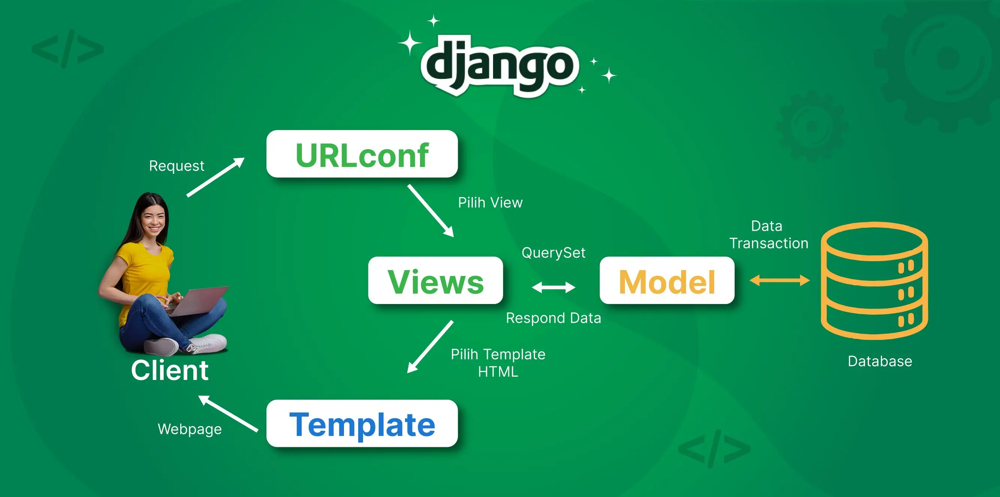

https://raffi-dewangga-realmashop.pbp.cs.ui.ac.id/

# Jelaskan bagaimana cara kamu mengimplementasikan checklist di atas secara step-by-step!
Saya mengerjakan setiap bagiman checklist dengan mengingat kembali bagaimana saya menyelesaikan tutorial-tutorial sebelumnya, jika saya lupa cara untuk melakukan sesuatu maka saya akan kembali ke halaman tutorial atau bertanya kepada teman-teman saya.

Saya memulai dengan membuat project Django. Pertama saya membuat direktori baru yang akan digunakan untuk menambahkan project ke github. Direktori ini dihubungkan ke github menggunakan git remote add (dengan link git). Selanjutnya jika ada perubahan pada code saya dapat menambahkannya ke github dengan commit dan push. Selanjutnya saya melakukan instalasi Django dengan membuat requirements berisi al-hal yang diperlukan untuk instalasi Django. Lalu pada terminal saya menjalankan django-admin startproject real_mashop (nama file) . untuk membuat project django ini.

Kemudian saya membuat file .env untuk menyimpan informasi konfigurasi seperti credential database, API keys, atau pengaturan environment. File ini digunakan agar code ini dapat berjalan di environment tanpa perlu mengupdate codenya. Saya juga membuat file .env.prod dengan production = true, aplikasi akan menggunakan database PostGre SQL. Kemudian isi dari settings.py perlu diubah agar env bisa diload dari env filenya.

Lalu saya menambahkan project ke dalam git dengan git add ., git commit -m "pesan", dan git push origin master.Kemudian saya menghubungkan PWS dengan menambahkan kode URL deployment PWS pada list ALLOWED_HOST pada settings.py sehingga PWS menjadi host.

Setelah melakukan hal-hal tersebut, saya mulia membuat aplikasi dengan nama "main" dan nama toko "real_mashop". Aplikasi ini adalah aplikasi mengenai sportswear, maka model-model di models.py perlu diubah sesuai dengan ketentuan pada tugas. Pada bagian ini terdapat tipe-tipe data tertentu yang digunakan:
CharField --> untuk menyimpan teks pendek
TextField --> untuk menyimpan teks panjang
IntegerField --> untuk menyimpan angka bulat
URLField --> untuk menyimpan url
BooleanField --> untuk true or false

Kemudian saya membuat template HTML dengan nama main.html. Page ini berisi konten seperti nama toko, nama, dan kelas yang kemudian akan ditampilkan menggunakan routing. Routing dilakukan menggunakan file views.py dan urls.py. Views.py untuk memproses permintaan dan mengirimkan respons (context) dan urls.py untuk menentukan URL yang digunakan. Di dalam main.html digunakan sintaks Django seperti {{ aplikasi }}, {{ name }}, {{ class }}, yang disebut template variables untuk menampilkan nilai dari variabel dalam context.

Setelah proses routing, selanjutnya project akan dideploy pada PWS menggunakan git add ., git commit -m "pesan", git push origin master, git push pws master. Proses pembuatan aplikasi main sudah selesai. 

# Buatlah bagan yang berisi request client ke web aplikasi berbasis Django beserta responnya dan jelaskan pada bagan tersebut kaitan antara urls.py, views.py, models.py, dan berkas html.
 https://www.biznetgio.com/news/django (bagan terdapat pada link)
Client akan melakukan request yang diterima oleh URL. Kemudian akan dipilih views yang sesuai. Kemudian views akan berinteraksi dengan model untuk mengelola data di database, yang kemudian akan memilih template yang sesuai untuk memberikan halaman web kepada client. urls.py digunakan utnuk memetakan pola URL ke fungsi, views.py menangani permintaan (memproses input), models.py digunakan untuk membaca atau menulis ke database, dan berkas html digunakan sebagai template tampilan.

# Jelaskan peran settings.py dalam proyek Django!
settings.py memiliki peran penting dalam proyek Django ini. Pada settings.py dapat ditambahkan allowed_host, Konfigurasi Database, Pengaturan Template. Intinya settings.py dapat digunakan untuk memodifikasi perilaku dari proyek Django ini.

# Bagaimana cara kerja migrasi database di Django?
Migrasi database pada Django digunakan untuk memperbarui database agar sesuai dengan perubahan pada model Django dengan membuat dan menerapkan migrasi. Migrasi di Django adalah jembatan code dengan database. Alurnya adalah mendefinisikan model, buat file migrasi, jalankan migrasi ke database.

# Menurut Anda, dari semua framework yang ada, mengapa framework Django dijadikan permulaan pembelajaran pengembangan perangkat lunak?
Django sering dipilih untuk permulaan pembelajaran pengembangan perangkat lunak karena framework Django memiliki semua yang developer butuhkan untuk membuat suatu aplikasi web. Django memiliki struktur yang jelas yaitu MVT, Django sudah memiliki fitur-fitur bawaan, dari segi keamanan Django memiliki keamanan yang lebih baik jika dibandingkan dengan PHP.

# Apakah ada feedback untuk asisten dosen tutorial 1 yang telah kamu kerjakan sebelumnya?
Untuk tutorial menurut saya cukup mudah dimengerti, setiap langkah dijelaskan dengan cukup rinci dan diberikan contoh image pada beberapa step untuk mempermudah pengerjaan tutorial.